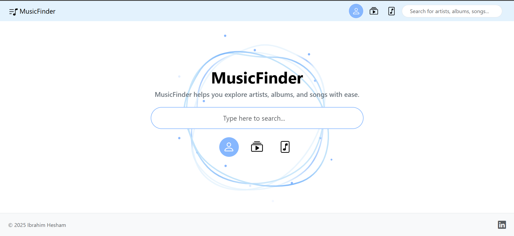
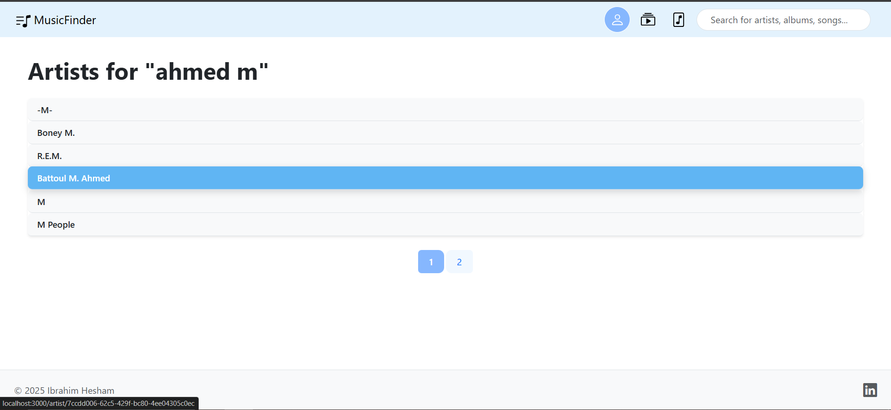
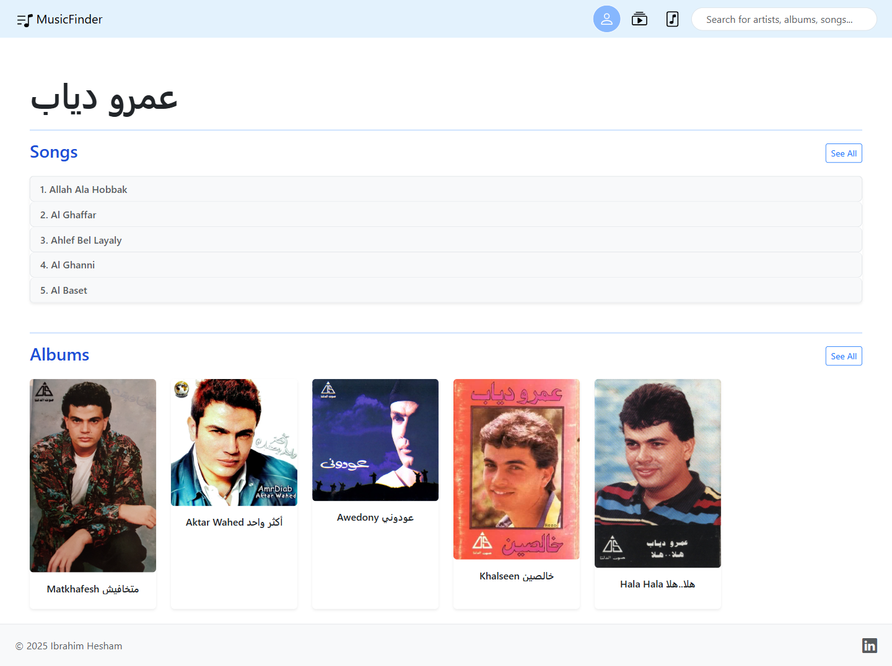
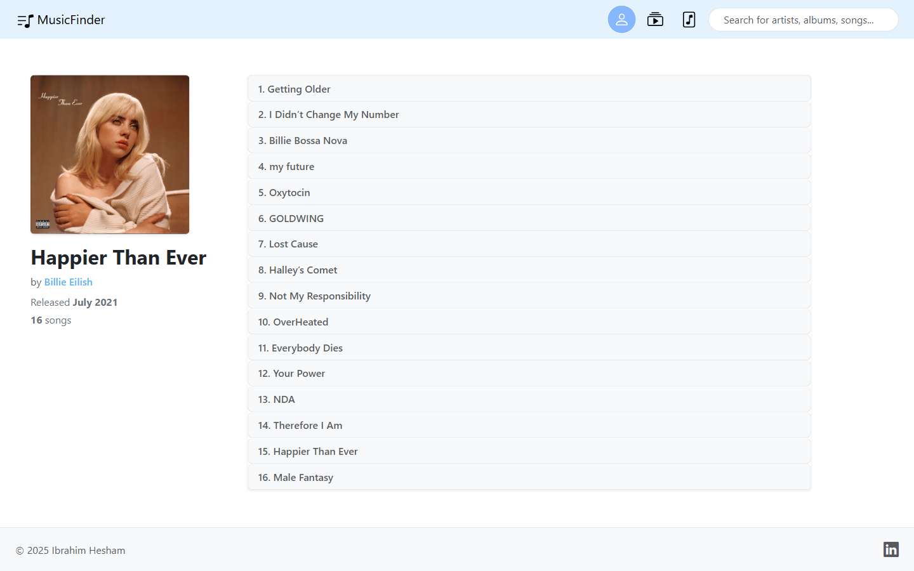

<a id="readme-top"></a>
[](https://www.linkedin.com/in/ibrahim-hesham-abdel-dayem/)

<!-- PROJECT LOGO -->
<br />
<div align="center">
  <a href="https://github.com/ibraaahim11/Music_Finder">
    
  </a>

<h3 align="center">MusicFinder</h3>

</div>

<!-- TABLE OF CONTENTS -->
<details>
  <summary>Table of Contents</summary>
  <ol>
    <li>
      <a href="#about-the-project">About The Project</a>
      <ul>
        <li><a href="#built-with">Built With</a></li>
        <li><a href="#ap-is-used">APIs Used</a></li>
      </ul>
    </li>
    <li><a href="#getting-started">Getting Started</a></li>
    <li>
      <a href="#usage">Usage</a>
      <ul>
        <li><a href="#preview">Preview</a></li>
      </ul>
    </li>
    <li><a href="#prerequisites">Prerequisites</a></li>
    <li><a href="#installation">Installation</a></li>
    <li><a href="#license">License</a></li>
  </ol>
</details>


<!-- ABOUT THE PROJECT -->

### <a id="about-the-project"></a>About The Project

I created this project to get some practice using public API's with Express.js.

MusicFinder has a vast knowledge of artists, albums, and songs. The search functionality returns only the most relevant results, and allows you to explore a vast catalog of music. You can dive deep into artists and view all their albums and songs. You will also find that the lyrics of the songs are also displayed.

The website has a sleek design with a calming pallete, and it is also mobile responsive.

Note: Website may be slow at times due to API restrictions. 😊



<p align="right">(<a href="#readme-top">back to top</a>)</p>

## <a id="built-with"></a>🛠️ Built With

[](https://developer.mozilla.org/en-US/docs/Web/HTML)
[](https://developer.mozilla.org/en-US/docs/Web/CSS)
[](https://getbootstrap.com/)
[](https://developer.mozilla.org/en-US/docs/Web/JavaScript)
[](https://nodejs.org/)
[](https://expressjs.com/)
[](https://ejs.co/)

## <a id="apis-used"></a>🌐 APIs Used

- [MusicBrainz API](https://musicbrainz.org/doc/MusicBrainz_API) – for metadata like artists, albums, and songs
- [Cover Art Archive](https://musicbrainz.org/doc/Cover_Art_Archive) – for fetching album artwork
- [Lyrics.ovh API](https://lyricsovh.docs.apiary.io/#) – for song lyrics

<p align="right">(<a href="#readme-top">back to top</a>)</p>

<!-- GETTING STARTED -->

## <a id="getting-started"></a>Getting Started

Follow these steps so you can run MusicFinder locally.

<!-- USAGE EXAMPLES -->

## <a id="usage"></a>📖 Usage

Here's what you can do with MusicFinder:

- 🔍 Search for artists, albums, or songs
- 🎵 Browse albums and view tracklists
- 📜 Read lyrics
- 🖼️ View album artwork and artist info

### <a id="preview"></a>🖼️ Preview


_Search for any artist, album or song_


_View search results_


_View songs and albums by the artist_


_See album details and track list_


_Read lyrics and see song info_

<p align="right">(<a href="#readme-top">back to top</a>)</p>

## <a id="prerequisites"></a>Prerequisites

Before running this project, make sure you have the following installed on your machine:

- [Node.js](https://nodejs.org/) (v16 or higher recommended)
- [npm](https://www.npmjs.com/) (comes with Node.js)
- A web browser (e.g., Chrome, Firefox)
- [Git](https://git-scm.com/) (for cloning the repository)

To verify installation:

```bash
node -v
npm -v
git --version
```

## <a id="installation"></a>Installation

1. Clone the repo

   ```sh
   git clone https://github.com/ibraaahim11/Music_Finder.git
   ```

2. Install NPM packages

   ```sh
   npm install
   ```

3. Run the development server
   ```sh
   npm start
   ```
4. Open in browser
   Go to http://localhost:3000 to explore the app.

<p align="right">(<a href="#readme-top">back to top</a>)</p>

<!-- LICENSE -->

## <a id="license"></a>License

This project is intended for educational purposes only and is not licensed for commercial use or redistribution.

<p align="right">(<a href="#readme-top">back to top</a>)</p>
